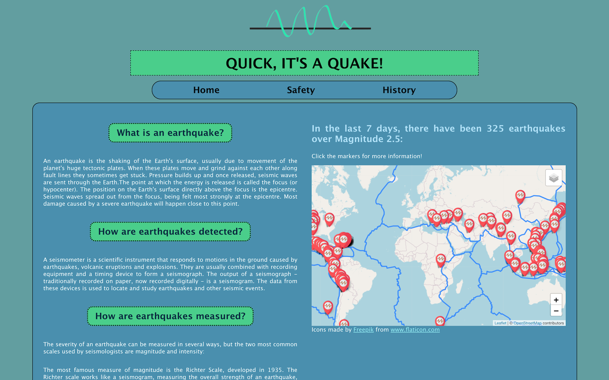
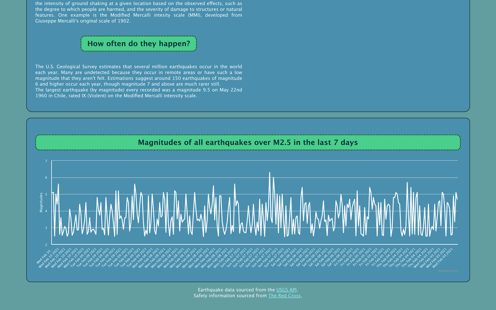
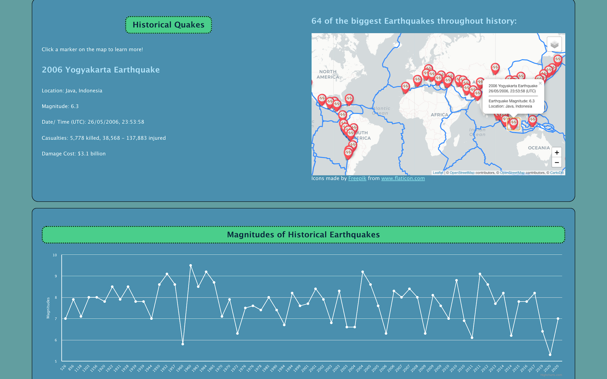

# Earthquake Educational App  

A full stack Javascript app using React, Express, and Mongodb.

Fetching realtime earthquake data from the USGS API .geojson and showing earthquakes on a leaflet map.

Using Mongodb to store information about historical earthquakes and rendering them to a seperate leaflet map.

Information sections (general info, safety and historical earthquakes data).

## Earthquake Data (USGS GeoJSON)

https://earthquake.usgs.gov/earthquakes/feed/v1.0/summary/2.5_week.geojson

  
## Screenshots







## Running the App  

In terminal:  

### Server

``` npm
cd server
npm install
```  

Seed the database:

``` npm
npm run seeds
```

Run express:

``` npm
npm run server:dev
```

### Client  

``` npm
cd ../client
npm install
npm run start
```

## Technologies  Used  

* React
* Express
* Mongodb
* leaflet.js
* highcharts.js